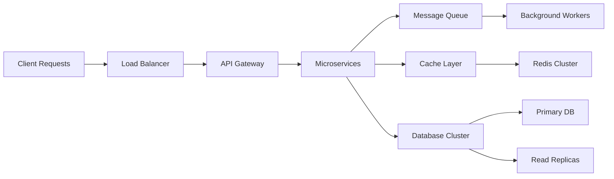

<div align="center">

# 👋 Hey, I'm Bishal KC

### Senior Full Stack Developer | Backend & System Design Nerd | Open to SaaS Collaborations

[](https://bishalis.dev)
[](https://github.com/bishalis-dev)
[](https://www.linkedin.com/in/bishalis-dev)
[](mailto:kcbishal2001@gmail.com)


</div>

---

## What I Do

```typescript
const bishal = {
  expertise: ["Backend Architecture", "System Design", "SaaS Development"],
  focus: ["Scalability", "Performance", "Automation"],
  passion: ["Event-Driven Systems", "Caching Strategies", "Queue Management"],
  currently: "Building the future, one API at a time"
};
```

- 🏗️ Building **scalable backend systems** & high-performance APIs
- 🏢 Designing **SaaS & multi-tenant architectures** from ground up
- ⚡ Obsessed with **queues, caching, system design & automation**
- 🤝 Collaborating on **innovative SaaS & startup ideas**

---

## Tech Stack & Tools

### **Languages & Frameworks**


### **Databases & Caching**


### **Cloud & Infrastructure**


### **Message Queues & Event Processing**


### **DevOps & Tools**


---

## GitHub Analytics

<div align="center">
  
  
</div>

<div align="center">
  
</div>

<div align="center">
  
</div>

---

## Notable Projects & Achievements

<table>
  <tr>
    <td align="center" width="50%">
      <h3>🧵 Event-Driven Systems</h3>
      <p>High-performance systems handling <strong>70k+ monthly traffic</strong> with robust queue management and real-time processing</p>
      
    </td>
    <td align="center" width="50%">
      <h3>🔊 AI Text → Podcast Platform</h3>
      <p>Real-time podcast generation using <strong>queue-based architecture</strong> with AI voice synthesis and processing</p>
      
    </td>
  </tr>
  <tr>
    <td align="center" width="50%">
      <h3>🛒 E-commerce & SaaS Platforms</h3>
      <p>Full-stack platforms with <strong>payment integrations, logistics</strong> and multi-tenant architecture</p>
      
    </td>
    <td align="center" width="50%">
      <h3>🧠 Recommendation Engines</h3>
      <p>Built <strong>trending & recommendation algorithms</strong> for content discovery and user engagement</p>
      
    </td>
  </tr>
</table>

---

## System Design Expertise



**Core Competencies:**
- ⚡ High-throughput API design (10k+ req/s)
- 🔄 Event-driven & microservices architecture
- 📦 Queue-based background job processing
- 🗄️ Database optimization & sharding strategies
- 🚀 CDN & multi-region deployment
- 📈 Real-time monitoring & observability

---

## Open for Collaboration

I'm actively looking to collaborate on:

- 💼 **SaaS & Startup Ideas** - Let's build the next big thing
- 🏗️ **Backend-Heavy Projects** - Complex systems are my playground
- 📊 **System Design Challenges** - Scaling is what I do best
- 🧪 **Open Source Contributions** - Giving back to the community

**Let's connect and build something amazing together!**

---

## Get In Touch

<div align="center">

[](mailto:kcbishal2001@gmail.com)
[](https://www.linkedin.com/in/bishalis-dev)
[](https://bishalis.dev)

</div>

---

<div align="center">
  
###  _"Ship fast. Scale safely."_ 


** From [bishalis-dev](https://github.com/bishalis-dev) - Building the future, one commit at a time**

</div>
